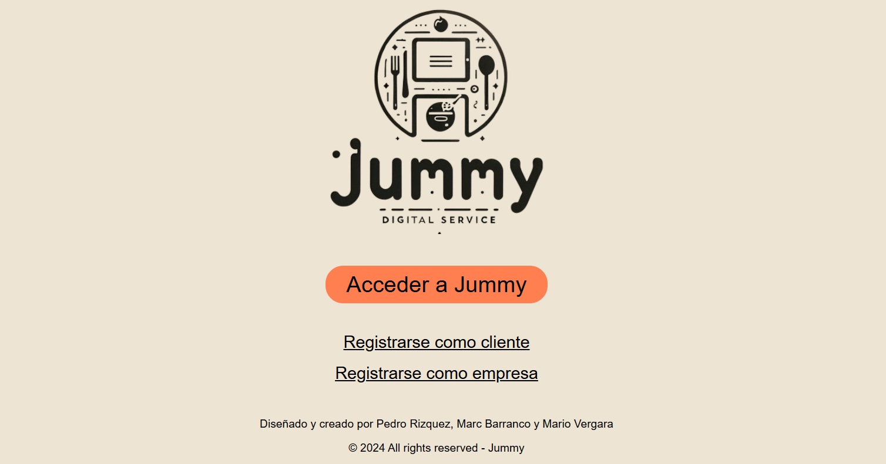

# JUMMY - La nueva era de la hostelería digital



## 🧾 Descripción del Proyecto
Jummy es la aplicación revolucionaria diseñada para transformar la interacción entre restaurantes y clientes, llevando la industria de la hostelería a la era digital. Con un enfoque en la optimización y modernización del servicio, Jummy permite a los restaurantes gestionar de manera eficiente sus menús, pedidos y pagos, mejorando tanto la experiencia del cliente como la operativa del restaurante. A través de la aplicación, los clientes pueden explorar diversos restaurantes clasificados por gastronomía, autogestionar sus pedidos y enviarlos directamente a la cocina.

## 📑 Contexto
En los últimos años, la digitalización ha transformado múltiples sectores, y la hostelería no es la excepción. Sin embargo, muchos restaurantes aún enfrentan desafíos en la adopción de soluciones tecnológicas que mejoren tanto su eficiencia operativa como la experiencia del cliente. La falta de integración entre sistemas de pedidos, pagos, y gestión de menús digitales genera ineficiencias, errores y una experiencia insatisfactoria para el cliente.

A raíz de la pandemia de COVID-19, la necesidad de adoptar soluciones digitales en la hostelería se volvió aún más urgente, con una creciente demanda de opciones sin contacto, como los pedidos online y pagos digitales. Sin embargo, muchas soluciones en el mercado son complejas, costosas o no están adaptadas a las necesidades específicas de pequeños y medianos restaurantes.

Jummy nace de esta necesidad. Su misión es ofrecer una plataforma intuitiva, accesible y asequible que permita a los restaurantes gestionar digitalmente sus operaciones y mejorar la experiencia del cliente. Con Jummy, los restaurantes pueden ofrecer menús digitales interactivos, recibir pedidos en tiempo real directamente en la cocina y gestionar pagos de manera segura, todo desde una única aplicación. Además, Jummy ayuda a los restaurantes a diferenciarse al permitir que los clientes descubran nuevos lugares basados en sus preferencias gastronómicas, facilitando la visibilidad de los restaurantes en el mercado local.

Jummy no solo mejora la eficiencia del servicio, sino que también beneficia a los clientes, dándoles más control sobre su experiencia en el restaurante, desde la selección del menú hasta el pago final. De esta manera, la aplicación busca revolucionar la hostelería, simplificando los procesos, reduciendo los errores y potenciando la satisfacción del cliente.

## 🚀 Funcionalidades Clave
- __Gestión de Menús Digitales:__ Los restaurantes pueden crear, editar y visualizar menús digitales atractivos y fáciles de usar, accesibles desde cualquier dispositivo móvil.
- __Sistema de Pedidos Integrado:__ Los clientes pueden realizar sus pedidos directamente desde la aplicación, lo que reduce tiempos de espera y minimiza errores en los pedidos.
- __Proceso de Pago Seguro:__ Jummy incluye una opción de pago integrada y segura, que permite a los clientes realizar pagos desde su propio dispositivo, mejorando la seguridad y reduciendo riesgos de impago.
- __Análisis y Reportes:__ Los restaurantes tienen acceso a herramientas de análisis que les permiten evaluar el rendimiento de ventas, las preferencias de los clientes y otros indicadores clave, facilitando la toma de decisiones informadas.
- __Soporte Multilingüe:__ La aplicación ofrece soporte en varios idiomas, asegurando su accesibilidad para usuarios de diferentes regiones y culturas.

## 🛠️ Tecnologías Utilizadas
Jummy está construido con una sólida base tecnológica que garantiza velocidad, seguridad y una excelente experiencia de usuario. Entre las tecnologías empleadas se incluyen:
- Backend: `Flask`.
- Frontend: `Vue.js`.
- Base de datos: `MySQL`.
- Seguridad: Autenticación JWT (`Auth0`).
- Infraestructura: Despliegue del Frontend en `Netlify` y del Backend en `Render`; almacenamiento de la Base de Datos en linea en `Clever Cloud`.

## 📂 Estructura del Proyecto
El proyecto está organizado en tres directorios principales, lo que facilita su mantenimiento y escalabilidad. Debido a la cantidad de carpetas y archivos involucrados, se ha separado en las siguientes secciones para una mejor comprensión:

### jummy-back (Backend)
```
├── config
│   └── config.py
├── src
│   ├── models
│   │   └── models.py
│   ├── routes
│   │   └── routes.py
│   └── tools
│       └── tools.py
├── .gitignore
└── main.py
```
> [!IMPORTANT]
> Dentro de `jummy-back` debe existir un fichero llamado `.env` el cual contiene las variables de entonro necesarias para la ejecucion del proyecto. Por seguridad este fichero nunca es subido a `GitHub` y el mismo esta configurado para generarse durante el despliegue a produccion del Backend. De necesitar los valores de estos parametros, conmuniquese con los responsables del proyecto.

### jummy-front (Frontend)
```
├── .vscode/...
├── dist/...
├── public/...
├── src
│   ├── assets
│   │   ├── images/...
│   │   ├── styles/...
│   │   └── main.css
│   ├── components
│   │   ├── Dish.vue
│   │   ├── Footer.vue
│   │   ├── HeaderClient.vue
│   │   └── HeaderHome.vue
│   ├── router
│   │   └── index.js
│   ├── stores
│   │   └── counter.js
│   ├── views/...
│   ├── App.vue
│   └── main.js
├── .gitignore
├── index.html
├── jsconfig.json
├── package-lock.json
├── package.json
├── README.md
├── vite.config.js
└── vitest.config.js
```

### jummy-scripts (Scripts SQL)
```
├── script-gastronomias.sql
└── script-restaurantes.sql
```

## 🖥️ Descripción de las Ramas de Trabajo en Git
- __main__: Esta es la rama principal, utilizada para el despliegue en `Netlify` y `Render`.
- __develop__: Recibe el desarrollo y cambios nuevos, sirviendo como filtro antes de fusionarse con main para evitar la introducción de código no testeado que pueda afectar al sistema en producción.
- __dev_pedro__: Rama de desarrollo de `Pedro`.
- __dev_mario__: Rama de desarrollo de `Mario`.
- __dev_marc__: Rama de desarrollo de `Marc`.

> [!IMPORTANT]
> Solo las ramas `main` y `develop` deben contener el directorio `dist` dentro de `jummy-front`, el cual es esencial para el despliegue en `Netlify`. Este directorio debe actualizarse localmente sobre la rama `develop` cada vez que se quiera realizar un despliegue a produccion, esto solo aplica al `Frontend`.

## 🚧 Contribuciones
Este proyecto __no__ está abierto a contribuciones externas. No se aceptarán pull requests ni issues. Gracias por tu comprensión.

## 📄 Licencia
Este proyecto se distribuye bajo la `Licencia GPL-3.0`, lo que permite su uso, distribución y modificación bajo ciertas condiciones. Consulta el archivo `LICENSE` para obtener más información.
© 2024 Todos los derechos reservados.
